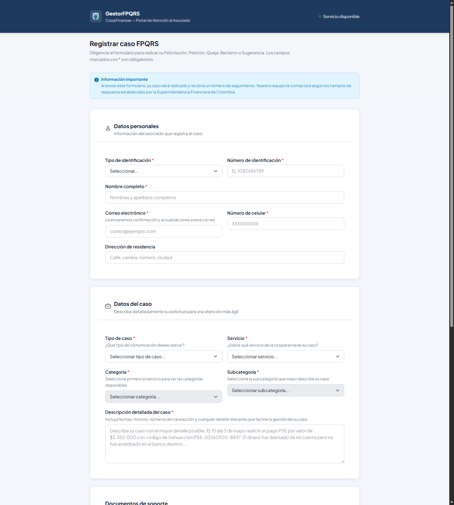
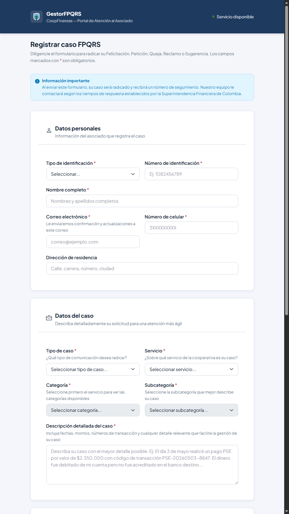

# GestorFPQRS - CoopFinanzas

Sistema frontend estático para la radicación y gestión de FPQRS
(Felicitaciones, Peticiones, Quejas, Reclamos y Sugerencias) de una cooperativa financiera colombiana.

El proyecto está orientado a una prueba de maquetación/frontend: prioriza estructura HTML semántica,
responsive design, componentes reutilizables, accesibilidad básica y una experiencia visual consistente.

## Capturas

### Formulario público - Desktop



### Formulario público - Tablet




## Páginas Incluidas

| Página | Descripción |
| --- | --- |
| `fpqrs-form.html` | Formulario público para radicar casos FPQRS. |
| `login.html` | Acceso y registro simulado para empleados. |
| `inbox.html` | Bandeja interna con métricas, filtros, tabla y paginación. |
| `case-detail.html` | Vista de detalle, gestión, historial y reasignación de caso. |
| `parametrizacion.html` | Administración de catálogos (servicios, categorías y subcategorías). |

## Stack

- HTML5 semántico
- CSS3 con custom properties
- JavaScript ES5
- jQuery 3.7.1
- Bootstrap 5.3.3 desde CDN
- Bootstrap Icons 1.11.3 desde CDN

No requiere backend, build process ni instalación de dependencias.

## Cómo Ejecutarlo

Abrir directamente cualquiera de los archivos HTML en el navegador:

```text
fpqrs-form.html
login.html
inbox.html
case-detail.html
parametrizacion.html
```

El proyecto funciona por `file://`. Los datos principales están embebidos en `js/main.js`
para evitar problemas de CORS al abrir archivos locales.

Opcionalmente puede servirse con un servidor estático para probar la carga de `data/cases.json`.

## Credenciales Demo

| Rol | Correo | Contraseña |
| --- | --- | --- |
| Administrador | `admin@coopfinanzas.com.co` | `Admin@2026!` |
| Operador | `operador@coopfinanzas.com.co` | `Oper@2026!` |
| Supervisor | `supervisor@coopfinanzas.com.co` | `Super@2026!` |

## Funcionalidades Simuladas

El proyecto no usa backend real. Las siguientes interacciones están simuladas en frontend para demostrar flujo, estados de UI y lógica de maquetación:

- Autenticación de empleados con usuarios demo cargados desde `js/main.js`.
- Registro de usuarios en memoria durante la sesión actual.
- Sesión con `localStorage` usando el prefijo `FPQRS_`.
- Carga de casos, responsables, servicios, categorías y subcategorías desde datos embebidos.
- Fallback a `data/cases.json` solo cuando el proyecto se sirve por HTTP.
- Radicación de casos con número generado automáticamente.
- Validación visual del formulario público con estados `is-valid` e `is-invalid`.
- Selects en cascada: Servicio → Categoría → Subcategoría.
- Adjuntos con validación de tipo, tamaño, duplicados y límite de archivos.
- Toasts de éxito, error, advertencia e información.
- Overlay de carga durante operaciones simuladas.
- Bandeja con búsqueda, filtros, ordenamiento visual, paginación y estados vacíos.
- Métricas del dashboard calculadas desde datos mock.
- Reasignación, cambio de estado y observaciones en la vista de detalle.
- Exportación de casos representada con feedback visual, sin descarga real de archivo.
- Cálculo visual de prioridad, estado, semáforo de SLA y badges.

## Decisiones De Maquetación

- Sistema visual basado en variables CSS para color, sombras, bordes, tipografía y layout.
- Color principal azul corporativo original con sidebar azul oscuro, manteniendo contraste en textos y acciones.
- Formulario público separado en secciones claras, con encabezados de alto contraste.
- CSS específico del formulario centralizado en `css/public-form.css`.
- Estados visuales para hover, selección, validación, carga, toasts y foco de teclado.
- Diseño responsive para móvil, tablet y escritorio.
- Fallback mínimo de utilidades críticas para que la UI no colapse si el CDN de Bootstrap tarda o falla.

## Accesibilidad Y UX

- Labels asociados a controles de formulario.
- Mensajes de error conectados con `aria-describedby` y mensajes específicos por campo.
- Dropzone usable con clic, Enter y barra espaciadora.
- Foco visible en botones, enlaces, campos y elementos interactivos.
- Toasts y contadores con regiones actualizables cuando aplica.
- Contraste revisado en textos auxiliares y encabezados.

## Estructura

```text
proyecto-fpqrs/
├── fpqrs-form.html
├── login.html
├── inbox.html
├── case-detail.html
├── parametrizacion.html
├── css/
│   ├── styles.css
│   ├── responsive.css
│   └── public-form.css
├── js/
│   ├── main.js
│   ├── form.js
│   ├── auth.js
│   ├── cases.js
│   └── parametrizacion.js
├── data/
│   └── cases.json
└── assets/
    ├── images/
    └── screenshots/
```

## Notas

- La autenticación y persistencia son simuladas con `localStorage`.
- Las contraseñas están en texto plano porque es una maqueta/demo.
- Los cambios de casos no persisten después de recargar, salvo la sesión.
- El foco principal del proyecto es demostrar maquetación, responsive, estructura y criterio frontend.
